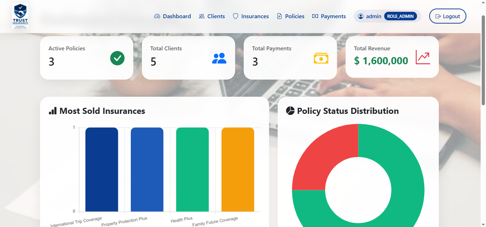
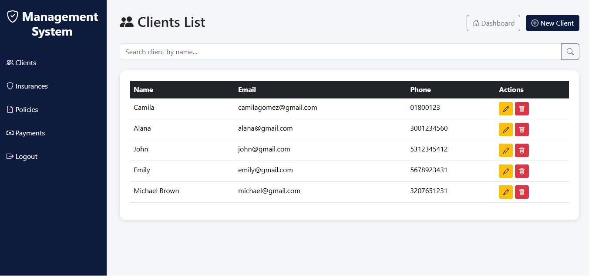
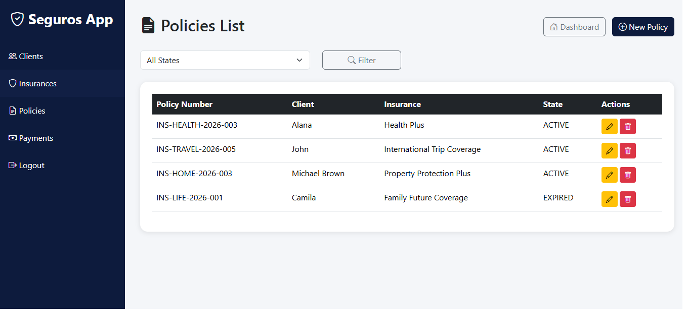
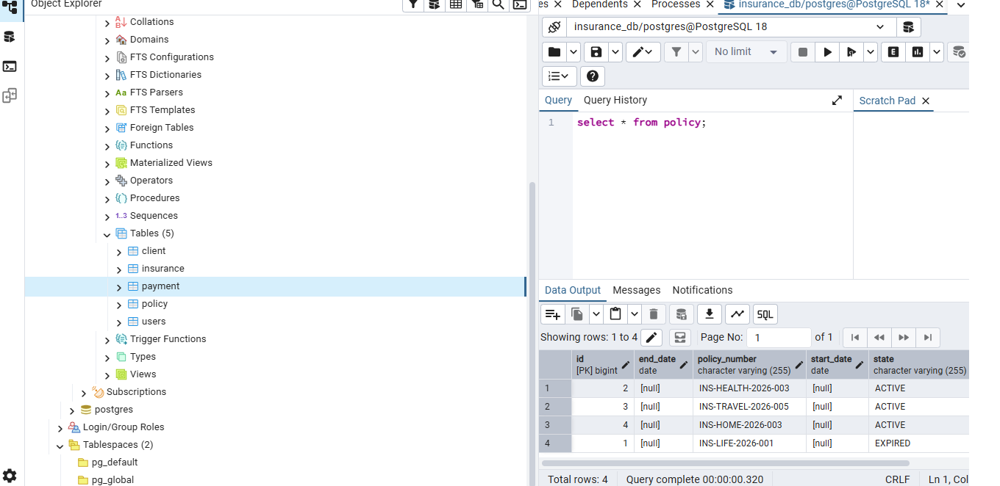

# Insurance Management System

A web-based Insurance Management System built with Java and Spring Boot.

## Overview

This application allows insurance companies to manage:

- Clients
- Insurance products
- Policies
- Payments
- User authentication and authorization

The system includes role-based access control and a modern web interface.

---

## Technologies

- Java 17
- Spring Boot 3.3.5
- Spring Security
- Spring Data JPA
- Thymeleaf
- Bootstrap 5
- PostgreSQL
- Maven
- OpenPDF

---

## Features

### Authentication & Security

- Secure login system
- Role-based access control
- Admin, Employee and Client roles
- Password encryption using BCrypt

### Client Management

- Create clients
- Edit clients
- Delete clients
- Search clients

### Insurance Management

- Create insurance plans
- Update insurance information
- Delete insurance products
- Search insurance plans

### Policy Management

- Create policies
- Manage policy status
- Filter policies by state

### Payment Management

- Register payments
- Generate PDF invoices
- Generate payment reports

### Dashboard

- Total clients
- Total policies
- Total payments
- Revenue overview
- Insurance statistics
- Policy status charts

---

## Database Migration

This project was originally developed using H2 Database.

Recently, it was migrated to PostgreSQL to provide persistent storage and a more production-ready architecture.

- Persistent data storage
- Better scalability
- Production-ready architecture

---

## Project Structure

```text
Controller
Service
Repository
Model
Configuration
Templates
Static Resources
```

---

## Screenshots

### Dashboard



### Clients



### Policies



### PostgreSQL Database



---

## Future Improvements

- Docker support
- REST API documentation with Swagger
- Deployment on Render or Railway
- Unit and integration testing
- Email notifications improvements

---

## Author

Luis Alexander Ramirez Valencia

Software Engineering Student

Java Backend Developer

Medellín, Colombia
